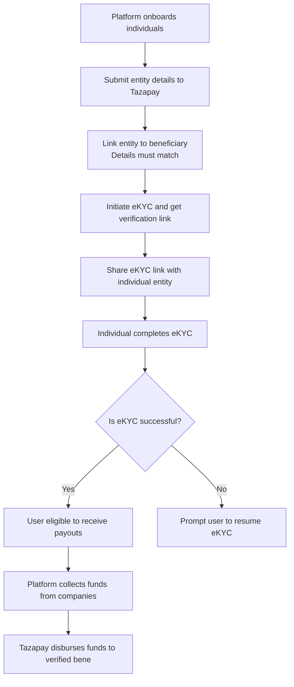

## Overview

Tazapay enables platforms to onboard and verify individual entities (e.g., employees, contractors, freelancers) and disburse payouts to them using a compliant, secure, and PSD2-aligned payment infrastructure. This guide outlines the process flow and responsibilities involved in enabling eKYC and payout capabilities through Tazapay.

This guide is ideal for platforms such as Employers of Record (EORs), marketplaces, or education platforms that want to:

* Onboard individuals as legal entities
* Perform global eKYC verification
* Facilitate payouts using collected funds

***

## Key Concepts

**Individual Entity**\
A legal identity representing an individual (e.g., employee or contractor) submitted by the platform.

**Beneficiary (Bene)**\
The payout recipient linked to the entity.

**eKYC**\
Electronic Know Your Customer verification process.

**Platform**\
The business integrating with Tazapay to manage onboarding, compliance, and payouts.

**PSP (Payment Service Provider)**\
Tazapay functions as a PSP under PSD2 regulations and does not directly collect or disburse funds.

***

## High-Level Flow

1. The platform (e.g., EOR) onboards individuals on their side.
2. The platform submits entity details to Tazapay.
3. The platform links the entity to a beneficiary (bene). Entity and beneficiary details should match.
4. Platform then initiates eKYC and shares a verification link with the individual entity.
5. The individual entity completes eKYC using the provided link.
6. On successful verification, the user becomes eligible to receive payouts.
7. Funds collected by the platform are disbursed to verified beneficiaries through Tazapay.

***

## Flow Diagram

***

## Session Handling & Failures

If the user does not complete eKYC in one session:

* The platform should display a **Call-to-Action (CTA)** for the user to resume verification.
* Depending on token expiry, the eKYC flow can either:
  * Be resumed using the existing link.
  * Require a new link and token (regenerated by the platform).

This ensures the platform has complete control over the user experience while staying compliant with verification standards.

***

## Example Use Case (EOR)

An Employer of Record (EOR) wants to onboard its client companies' employees:

* Each employee is created as an individual entity in Tazapay.
* The EOR collects salaries from the companies.
* Tazapay performs eKYC to verify each employee.
* Once verified, payouts are processed to their linked bank accounts via the Tazapay PSP infrastructure.

This guide supports both generic onboarding flows and specific business models like EORs embedded in it.

***

## Summary

Tazapay offers a streamlined and compliant way to onboard individual entities and manage payouts globally. Platforms can:

* Maintain full control over onboarding individuals
* Delegate regulatory requirements to Tazapay's secure infrastructure
* Enable seamless disbursals through verified eKYC flow