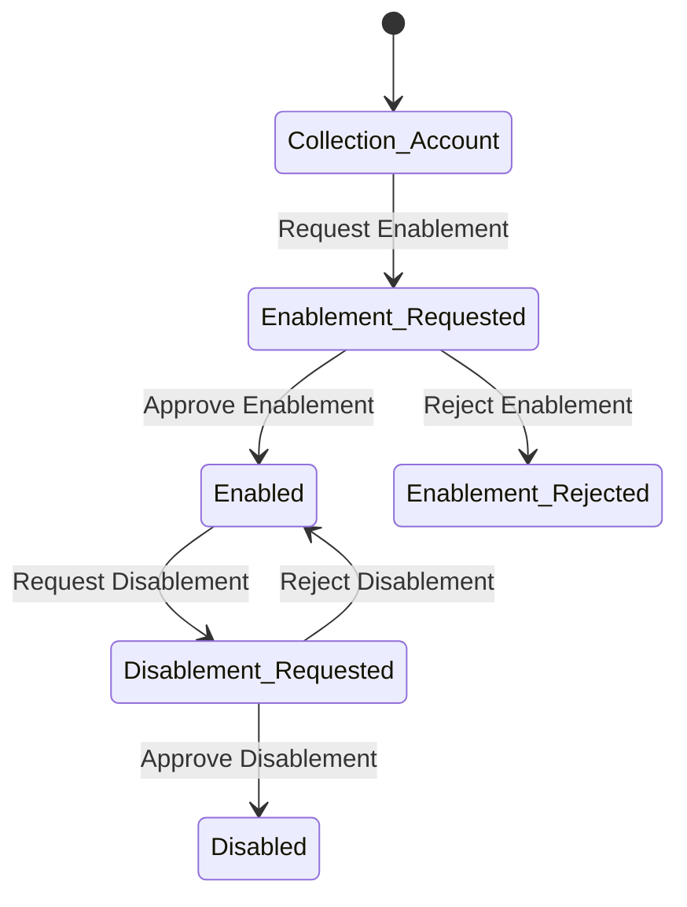

This diagram helps visualize how a collection account moves between different states based on enablement and disablement requests, and how those transitions are either approved or rejected.

 

# State Diagram Explanation

This state diagram illustrates the lifecycle of a Collection Account and its possible states and transitions. The collection account can exist in several states depending on requests and actions taken:

## Enablement\_Requested:

If a request to enable the collection account is made, the account moves to the Enablement\_Requested state. This means a request for the account to be enabled has been initiated.

## Transition from Enablement\_Requested to Enabled:

If the request for enablement is approved, the collection account transitions to the Enabled state, which means the account is now fully enabled and ready for use in collecting payments.

## Transition from Enablement\_Requested to Enablement\_Rejected:

If the request for enablement is rejected, the collection account moves to the Enablement\_Rejected state, indicating that the account is not enabled and further action is needed to resolve the situation.

## Enabled:

This is the state where the collection account is active and fully operational, allowing the business to collect payments.

## Transition from Enabled to Disablement\_Requested:

If a request to disable the account is made, the account moves to the Disablement\_Requested state. This means that the account is under review for disabling.

## Transition from Disablement\_Requested to Disabled:

If the request to disable the account is approved, the account moves to the Disabled state, indicating that the collection account is now inactive and cannot be used for payments.

## Transition from Disablement\_Requested to Enabled:

If the request to disable the account is rejected, the collection account remains in the Enabled state, meaning the account is not disabled and continues to function as normal.

# Summary of Transitions:

Request Enablement: The account can request to be enabled, and the request can either be approved (moving to Enabled) or rejected (moving to Enablement\_Rejected).

Request Disablement: The account can request to be disabled, and the request can either be approved (moving to Disabled) or rejected (staying in Enabled).