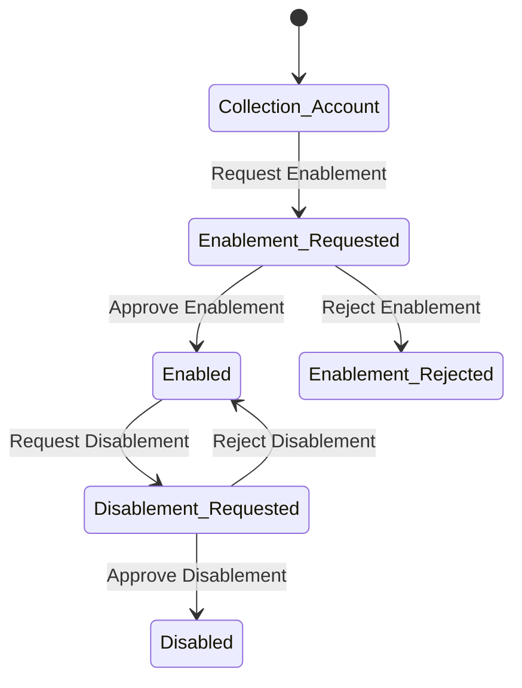

&#x20;

 

\[\*] --> Collection\_Account\
Collection\_Account --> Enablement\_Requested : Request Enablement
Enablement\_Requested --> Enabled : Approve Enablement
Enablement\_Requested --> Enablement\_Rejected : Reject Enablement
Enabled --> Disablement\_Requested : Request Disablement
Disablement\_Requested --> Disabled : Approve Disablement
Disablement\_Requested --> Enabled : Reject Disablement